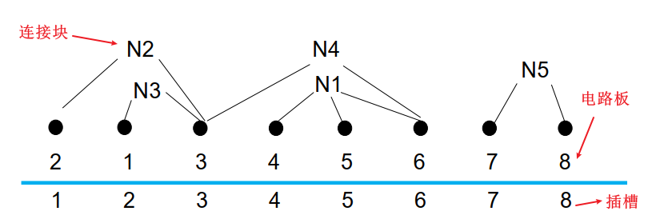

# 算法分析与设计[COMP462205]课本对应题目链接

本课程采用的课本是清华大学出版社出版的算法设计与分析（第四版），现将课本中所涉及的题目与线上OJ平台相关联，方便大家练习。

> 1.  vj平台：https://vjudge.net/problem/
> 2. 各个题目可以去相应的平台提交，也建议大家可以从vj平台提交，vj平台对应的题目链接为https://vjudge.net/problem/题目id。 如矩阵连乘问题的第一个题目id为“51Nod - 3180"，则oj平台的对应题目链接为https://vjudge.net/problem/51Nod-3180 （注意空格等间隙要去掉）
> 3. 本仓库所有涉及的 OJ 题目均采用 **ACM 模式**（需自行处理输入输出），不同于 LeetCode 的核心代码模式。**如果你是新手**，建议参考：👉 [ACM 模式输入输出参考](./acm模式.md)  


## 递归与分支策略

### 全排列

[OpenJ_Bailian - 2748 ](https://vjudge.net/problem/OpenJ_Bailian-2748/origin)

[51Nod - 1384 ](https://vjudge.net/problem/51Nod-1384/origin)

### 整数划分

[NBUT - 1046](https://vjudge.net/problem/NBUT-1046/origin)

[OpenJ_Bailian - 4117](https://vjudge.net/problem/OpenJ_Bailian-4117/origin)

### 汉诺塔

原型汉诺塔没有找到，似乎是太简单了嘛？一些变形汉诺塔问题供大家练习：

[HDU - 2064 ](https://vjudge.net/problem/HDU-2064/origin)

[HDU - 1207](https://vjudge.net/problem/HDU-1207/origin)

### 二分搜索

这个太简单了，没有一模一样的题目！

### 大整数乘法

[OpenJ_Bailian - 2980 ](https://vjudge.net/problem/OpenJ_Bailian-2980/origin)

### strassen 矩阵乘法

[HDU - 6719](https://vjudge.net/problem/HDU-6719/origin)

### 棋盘覆盖

[洛谷 - U91193](https://vjudge.net/problem/洛谷-U91193/origin)

### 归并排序

没有找到，大家自己写程序练习吧！

可以用下面快速排序的用例来测试。

### 快速排序

[计蒜客 - T1746](https://vjudge.net/problem/计蒜客-T1746/origin)

### 线性时间选择

[洛谷 - U528642 ](https://vjudge.net/problem/洛谷-U528642/origin)

### 最接近对点

二维平面：[洛谷 - P1257 ](https://vjudge.net/problem/洛谷-P1257/origin)

一维线性：[SPOJ - CPOD1](https://vjudge.net/problem/SPOJ-CPOD1/origin)

### 循环赛日程表

[CSG - 1407](https://vjudge.net/problem/CSG-1407/origin)

## 动态规划

### 矩阵连乘问题

[51Nod-3180](https://vjudge.net/problem/51Nod-3180/origin)

[洛谷-U522991](https://vjudge.net/problem/洛谷-U522991/origin)

### 最长公共子序列

[计蒜客 - T1880 ](https://vjudge.net/problem/计蒜客-T1880/origin)

[洛谷 - P8697](https://vjudge.net/problem/洛谷-P8697/origin)

[51Nod - 1006](https://vjudge.net/problem/51Nod-1006/origin)

### 凸多边形最优三角剖分

[洛谷 - T153477](https://vjudge.net/problem/洛谷-T153477/origin)

### 多边形游戏

[洛谷 - P4342](https://vjudge.net/problem/洛谷-P4342/origin)

### 图像压缩

很遗憾，没找到！

### 电路布线

很遗憾，没找到！

### 流水作业调度

[洛谷 - P1248 ](https://vjudge.net/problem/洛谷-P1248/origin)

### 0-1背包问题

[洛谷 - U315727 ](https://vjudge.net/problem/洛谷-U315727/origin)

### 最优二叉搜索树

[AtCoder - atc002_c](https://vjudge.net/problem/AtCoder-atc002_c/origin)

### 最大子段和

[51Nod - 2076 ](https://vjudge.net/problem/51Nod-2076/origin)

### 最大子矩阵和

原题：[OpenJ_Bailian - 2766 ](https://vjudge.net/problem/OpenJ_Bailian-2766/origin)

子矩阵size已知：[HDU - 1559](https://vjudge.net/problem/HDU-1559/origin)

### 最大m子段和

[HDU - 1024](https://vjudge.net/problem/HDU-1024/origin)

[51Nod - 1053](https://vjudge.net/problem/51Nod-1053/origin)

### 货物储运

原题：[计蒜客 - T2544](https://vjudge.net/problem/计蒜客-T2544/origin)

扩展：[LibreOJ - 10147 ](https://vjudge.net/problem/LibreOJ-10147/origin)

## 贪心算法

### 活动安排问题

[LibreOJ - 10000](https://vjudge.net/problem/LibreOJ-10000/origin)

### 部分背包问题

[洛谷 - P2240](https://vjudge.net/problem/洛谷-P2240/origin)

### 最优装载

[CSG - 1411](https://vjudge.net/problem/CSG-1411/origin)

### 哈夫曼编码

[CSG - 1395](https://vjudge.net/problem/CSG-1395/origin)

### 单源最短路径

[洛谷 - P4779](https://vjudge.net/problem/洛谷-P4779/origin)

[UniversalOJ - 622](https://vjudge.net/problem/UniversalOJ-622/origin)

### 最小生成树

无向图：[51Nod - 1212](https://vjudge.net/problem/51Nod-1212/origin)  [LibreOJ - 123 ](https://vjudge.net/problem/LibreOJ-123/origin)

最小生成树的数量： [LibreOJ - 10070 ](https://vjudge.net/problem/LibreOJ-10070/origin)

## 回溯法

### 旅行售货员问题  

[CSG - 1431](https://vjudge.net/problem/CSG-1431/origin)

### 装载问题

不完全一样，但是差不多：[洛谷 - P1049](https://vjudge.net/problem/洛谷-P1049/origin)

### 批处理作业调度

没有找到

### 符号三角形

[HDU - 2510](https://vjudge.net/problem/HDU-2510/origin)

### n后问题

[洛谷 - T247305](https://vjudge.net/problem/洛谷-T247305/origin)

### 0-1背包问题

[洛谷 - U315727 ](https://vjudge.net/problem/洛谷-U315727/origin)

### 最大团问题

不仅仅求最大团，而且要求最大独立集：[洛谷 - P12371 ](https://vjudge.net/problem/洛谷-P12371/origin)

### 图的m着色问题

[洛谷 - P2819](https://vjudge.net/problem/洛谷-P2819/origin)

### 圆排列问题

[CSG - 1432](https://vjudge.net/problem/CSG-1432/origin)

### 电路板排列问题

没找到，说明一下此题目。



连接块连接的电路板是固定的，这是由外界所决定的，换句话说，N2永远都是连接电路板2和3。我们能改变的仅仅是每个电路板能插入的插槽号，2号电路板现在插入的是1号，它还可以插入2-8的任何一个插槽。而统计的是每两个相邻插槽所涉及到的连接块个数，例如第一个“缝隙”是插槽1和插槽2之间的，也就是电路板2和电路板1之间的，被跨越的连接块仅有N2一个。

数组`b[i][j]`表示的是电路板i是否在连接块j中，这是一开始就决定的，不论电路板怎么排列（插入哪个插槽中）。`total[j]`表示的是电路板j所连接的电路板数量，这也是一开始就决定的。只有`now[j]`是随着每次排列的情况而改变的。

如何判断此缝隙（插槽i和插槽i+1之间）是否被连接块j跨越呢？如果连接块能够跨越此缝隙，首先它必有一只脚插在`1~i`插槽之中，而另一只脚必须插在插槽`i+1~8`中。换句话说，也就是`1~i`中必须涉及连接块j所连接的电路板，但是不能全部包含（否则此连接板跨越的都在此缝隙之前了）。那么总结就是：`now[j]>0`表示有脚在我前面，并且`now[j]!=total[j]`表示不是所有脚都在我前面，也有脚在我后面——这就是跨越了此缝隙的条件。

### 连续邮资问题

[牛客 - 16813](https://vjudge.net/problem/牛客-16813/origin)

[计蒜客 - T2149 ](https://vjudge.net/problem/计蒜客-T2149/origin)

## 分支界限法

本章节的很多题目和[回溯法](##回溯法)这一章节题目相同，这里就不再赘述了。

> **分支限界法相比于回溯法，更强调利用“限界函数”剪掉那些不可能产生（更优）最优解的分支，从而加速找到最优解。但实际上，我们在回溯中已经强调了两种剪枝函数：**
>
> - 用约束函数在扩展结点处剪去不满足约束的子树；（你是不是可行解？）
> - 用限界函数剪去得不到最优解的子树（你是不是最优解？）
>
> 所以从通俗意义上，两者的区别可以理解成搜索策略不同罢了。

### 单源最短路径

可见[单源最短路径](###单源最短路径) 。

### 布线问题

[POJ - 3984 ](https://vjudge.net/problem/POJ-3984/origin)

### 0-1背包问题

分支界限示例代码：

```c++
#include <iostream>
#include <vector>
#include <queue>
using namespace std;

struct Node {
    int ew;   // 当前重量
    int i;    // 下一个物品下标
    int ub;   // 上界
    Node(int ew, int i, int ub) : ew(ew), i(i), ub(ub) {}
    // 优先队列按上界降序
    bool operator<(const Node& o) const { return ub < o.ub; }
};

int maxLoading(int n, int c, const vector<int>& w) {
    // 后缀和
    vector<int> r(n + 1, 0);
    for (int i = n - 1; i >= 0; --i) r[i] = r[i + 1] + w[i];

    int bestw = 0;
    priority_queue<Node> pq;
    pq.emplace(0, 0, r[0]);  // 根节点

    while (!pq.empty()) {
        Node cur = pq.top(); pq.pop();

        // 节点级剪枝
        if (cur.ub <= bestw) continue;

        // 到达叶节点
        if (cur.i == n) {
            bestw = max(bestw, cur.ew);
            continue;
        }

        // 左儿子：装
        int wt = cur.ew + w[cur.i];
        if (wt <= c) {
            int leftUb = (cur.i + 1 < n) ? wt + r[cur.i + 1] : wt;
            if (leftUb > bestw) pq.emplace(wt, cur.i + 1, leftUb);
        }

        // 右儿子：不装
        int rightUb = (cur.i + 1 < n) ? cur.ew + r[cur.i + 1] : cur.ew;
        if (rightUb > bestw) pq.emplace(cur.ew, cur.i + 1, rightUb);
    }
    return bestw;
}

int main() {
    int n, c;
    cin >> n >> c;
    vector<int> w(n);
    for (int i = 0; i < n; ++i) cin >> w[i];
    cout << maxLoading(n, c, w) << endl;
    return 0;
}
```

### 批处理作业问题

未找到。


最后，祝大家备考顺利！！
